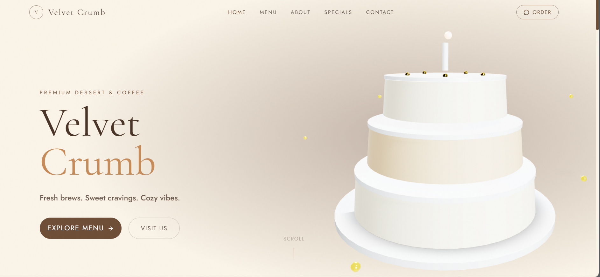
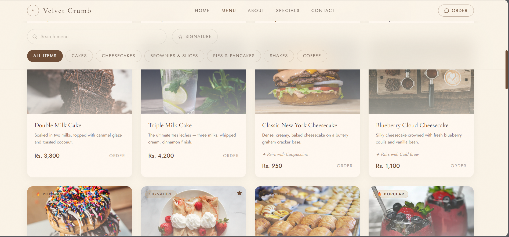
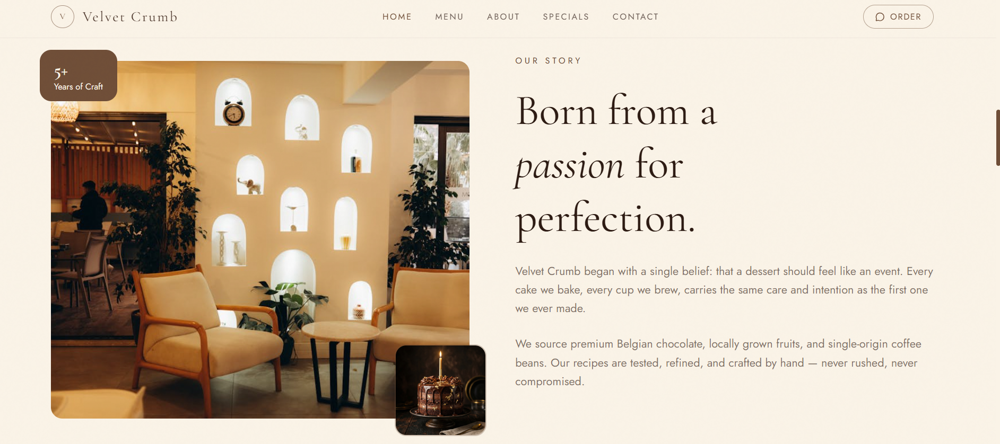

# Velvet Crumb — Premium Café Frontend

A premium café and dessert website built using React, TypeScript, and Vite.  
This project showcases a production-ready frontend with modern UI/UX, SEO optimization, accessibility, and performance best practices.

---

## 🌐 Overview

Velvet Crumb is a luxury-inspired café website designed to deliver a warm, cozy, and cinematic brand experience.

It includes:
- a refined hero section
- responsive multi-page layout
- interactive menu browsing
- real contact form integration
- SEO-ready structure
- performance and accessibility optimizations

---

## ⚙️ Tech Stack

- React
- TypeScript
- Vite
- Tailwind CSS
- React Router
- Framer Motion
- React Three Fiber (3D hero)

---

## ✨ Features

### 🎨 UI / UX
- Premium cozy café theme
- Responsive design across all devices
- Smooth animations and transitions
- Mobile-optimized hero with fallback image

### 📬 Contact System
- Integrated with Web3Forms
- Real email submission (frontend-only)
- Loading, success, and error states
- Honeypot spam protection

### 🔍 SEO & Metadata
- Dynamic page titles and descriptions
- Open Graph metadata
- Canonical URL handling
- LocalBusiness (CafeOrCoffeeShop) JSON-LD schema

### ⚡ Performance
- Lazy-loaded images
- WebP optimization
- 3D rendering disabled on mobile for performance
- CLS (layout shift) prevention

### ♿ Accessibility
- ARIA labels for interactive elements
- Focus states for keyboard navigation
- Improved screen reader compatibility

### 📄 Routing
- Multi-page routing with React Router
- Custom 404 Not Found page
- Scroll-to-top navigation behavior

---

## 📁 Project Structure

```bash
src/
  components/
  config/
  data/
  pages/
  App.tsx
  main.tsx
public/
  images/


##🚀 Getting Started
1. Clone the repo
git clone https://github.com/hassaan420/premium-cafe-frontend.git
cd premium-cafe-frontend
2. Install dependencies
npm install
3. Run development server
npm run dev
4. Build for production
npm run build
5. Preview build
npm run preview
##📬 Contact Form Setup

This project uses Web3Forms for handling form submissions.

To enable:

Go to https://web3forms.com
Enter your email to generate an access key
Replace the placeholder in Contact.tsx:
access_key: "YOUR_ACCESS_KEY"
🛠 Production Improvements Implemented
Contact API integration (Web3Forms)
Scroll restoration on route change
404 fallback page
Dynamic SEO metadata
Structured data (JSON-LD)
Mobile performance optimization
Accessibility enhancements
Spam protection (honeypot)
CLS-safe layout system
Clean codebase (no logs, no dev traces)
🔮 Future Improvements
Admin panel for content management
Backend integration (Supabase)
Dynamic menu system
Image upload and storage
Authentication system for admin
Dashboard for managing contact messages
📌 Use Case

This project is ideal as:

a café / bakery website
a frontend portfolio project
a base template for client projects
a foundation for full-stack business apps
👤 Author

Hassaan Shakir
GitHub: https://github.com/hassaan420

## 📸 Screenshots
## 📸 Screenshots
## 📸 Screenshots

### Home Page


### Menu Page


### About Page



